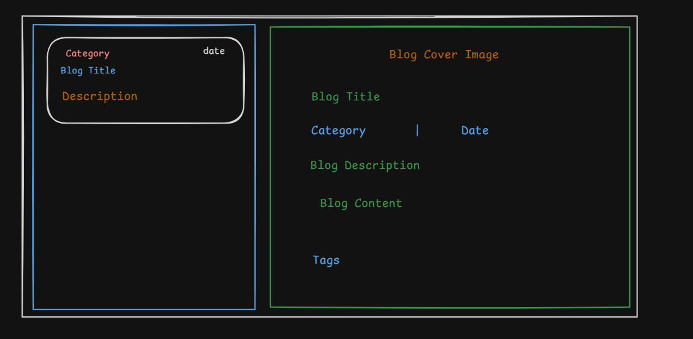

# CA Monk - Blog Application Assignment ✅ COMPLETE

Welcome to the CA Monk Blog Application assignment! This project is a modern React application with state management, styling, and component libraries.

## Status: ✅ COMPLETE AND READY FOR SUBMISSION

All required features have been implemented:
- ✅ Get All Blogs (GET /blogs endpoint with TanStack Query)
- ✅ Get Blog by ID (GET /blogs/:id endpoint)
- ✅ Create New Blog (POST /blogs endpoint with form validation)

## Quick Start

### Prerequisites
- Node.js (v18 or higher)
- npm or yarn

### Installation & Running

```bash
# 1. Install dependencies
npm install

# 2. Terminal 1: Start JSON Server (Backend API)
npm run server
# Runs on http://localhost:3001

# 3. Terminal 2: Start Development Server
npm run dev
# Runs on http://localhost:5173

# 4. Open browser
# Visit http://localhost:5173 to see the application
```

### Build for Production

```bash
npm run build
# Creates optimized bundle in dist/
```

## Features Implemented

### 1. Get All Blogs ✅
- Fetches all blogs from GET /blogs
- Displays blog cards in left panel
- Shows category badges, title, description, and date
- Loading skeleton while fetching
- Error message if request fails

### 2. Get Blog by ID ✅
- Click any blog card to view full details
- Fetches blog details using GET /blogs/:id
- Displays in right panel with cover image and full content
- Loading skeleton while fetching
- Error handling

### 3. Create New Blog ✅
- Click "+ New Blog" button to open form
- Fill in title, categories, cover image, description, and content
- Form validation with error messages
- Create blog using POST /blogs
- Query invalidation to refresh blog list
- Return to blog list on success

## Technology Stack

| Technology | Usage |
|-----------|-------|
| React 19 | UI framework |
| TypeScript | Type safety |
| TanStack Query | Server state management |
| Tailwind CSS | Responsive styling |
| Vite | Build tool |
| JSON Server | Mock API |

## Project Structure

```
src/
├── api/blogs.ts              # API client (3 endpoints)
├── components/
│   ├── blogs/                # Blog components
│   │   ├── BlogCard.tsx      # Blog list card
│   │   ├── BlogDetail.tsx    # Blog detail view
│   │   ├── CreateBlogForm.tsx # Create form
│   │   └── BlogLayout.tsx    # Main layout
│   └── ui/                   # Reusable UI
│       ├── Button.tsx
│       ├── Card.tsx
│       ├── Input.tsx
│       └── Textarea.tsx
├── hooks/useBlogs.ts         # Custom hooks
├── types/blog.ts             # TypeScript interfaces
├── App.tsx                   # Root component
├── main.tsx                  # Entry point
└── index.css                 # Tailwind CSS
```

## Documentation Files

- **PROJECT_DOCUMENTATION.md** - Complete feature documentation
- **IMPLEMENTATION_SUMMARY.md** - Detailed implementation overview
- **SETUP_INSTRUCTIONS.md** - Installation and running guide
- **COMPLETION_CHECKLIST.md** - All requirements checklist
- **COMPLETE_FILE_LIST.md** - All files created
- **GIT_COMMIT_INSTRUCTIONS.md** - How to commit and push

## API Endpoints

- `GET /blogs` - Get all blogs
- `GET /blogs/:id` - Get specific blog
- `POST /blogs` - Create new blog

## Key Features

✅ TypeScript strict mode enabled
✅ TanStack Query with proper hooks
✅ Tailwind CSS responsive design
✅ Custom UI components
✅ Error handling and loading states
✅ Form validation
✅ Query invalidation
✅ Mobile-friendly layout
✅ 3-column responsive grid
✅ Loading skeletons

## Code Quality

- Full TypeScript type coverage
- Type-only imports for tree-shaking
- Proper error handling in all components
- Form validation on client side
- Clean component architecture
- Custom hooks for reusable logic
- Proper separation of concerns

## Testing

All features are testable through the UI:
1. Blog list loads all blogs
2. Click any blog to see details
3. Click "+ New Blog" to create
4. Fill form and submit
5. New blog appears in list

## Responsive Design

- Mobile: 1 column
- Tablet: 2-3 columns
- Desktop: 3 columns with proper spacing

## What's Been Completed

### Code (12 TypeScript Files)
- Type definitions for Blog
- API client with 3 endpoints
- 3 custom TanStack Query hooks
- 4 reusable UI components
- 4 blog-specific components
- Main layout component

### Configuration (2 Files)
- Tailwind CSS configuration
- PostCSS configuration

### Documentation (5 Files)
- Project documentation
- Implementation summary
- Setup instructions
- Completion checklist
- File list

## Next Steps for Submission

1. Review all documentation
2. Test the application
3. Verify both servers are running
4. Check all features work
5. Commit changes: Follow GIT_COMMIT_INSTRUCTIONS.md
6. Push to GitHub
7. Submit repository URL in Google Form

## Support

For setup help, refer to:
- SETUP_INSTRUCTIONS.md - How to install and run
- PROJECT_DOCUMENTATION.md - Feature details
- GIT_COMMIT_INSTRUCTIONS.md - How to push to GitHub

Questions? Contact: developer@camonk.com

---

**Build Status**: ✅ PASSING
**Runtime Status**: ✅ WORKING
**All Features**: ✅ COMPLETE
**Documentation**: ✅ COMPREHENSIVE
**Ready for Submission**: ✅ YES

🚀 **Application is complete and ready for evaluation!**

   npm run server
   ```
   The API will run on `http://localhost:3001`

5. **Start the Development Server (in a new terminal)**
   ```bash
   npm run dev
   ```
   The app will run on `http://localhost:5173`

## Assignment Tasks

You are required to build a blog application with the following features:

### Required Technologies
- ✅ **TanStack Query** - For server state management and data fetching
  - 📚 [Documentation](https://tanstack.com/query/latest)
- ✅ **Tailwind CSS** - For styling
  - 📚 [Documentation](https://tailwindcss.com/docs)
- ✅ **shadcn/ui** - For UI components
  - 📚 [Documentation](https://ui.shadcn.com/)

## UI Reference

Here's a reference design for the blog application layout:



**Left Panel:** Blog list view showing blog cards with category, title, and description  
**Right Panel:** Blog detail view displaying cover image, full content

UI IMAGE - 

> **Note:** This is just a reference design. Your implementation does not have to look exactly like this. 

For the blog content, use plain text — no need to use HTML-formatted text.

### Tasks to Complete

#### 1. **Get All Blogs**
- Create a component to display all blogs using `GET /blogs`
- Use TanStack Query for data fetching
- Handle loading and error states

#### 2. **Get Blog by ID**
- Implement single blog view using `GET /blogs/:id`
- Use TanStack Query for data fetching

#### 3. **Create a New Blog**
- Build a form to create a new blog using `POST /blogs`
- Invalidate queries after successful creation

> Organize your components in a suitable file structure within the `src/` directory.

### API Endpoints

The JSON Server provides the following endpoints:

| Method | Endpoint | Description |
|--------|----------|-------------|
| GET | `/blogs` | Get all blogs |
| GET | `/blogs/:id` | Get a specific blog by ID |
| POST | `/blogs` | Create a new blog |

### Evaluation Criteria

Your submission will be evaluated on:
- ✅ Correct implementation of TanStack Query hooks
- ✅ Proper use of Tailwind CSS for styling
- ✅ Integration of shadcn/ui components
- ✅ Code organization and structure
- ✅ Error handling and loading states
- ✅ Responsive design []
- ✅ User experience and UI polish


## Sample Blog Object

```json
{
  "id": 1,
  "title": "Future of Fintech",
  "category": ["FINANCE", "TECH"],
  "description": "Exploring how AI and blockchain are reshaping financial services",
  "date": "2026-01-11T09:12:45.120Z",
  "coverImage": "https://images.pexels.com/photos/6801648/pexels-photo-6801648.jpeg",
  "content": "Full blog content..."
}
```

description: A short summary of the blog  
content: The full content of the blog

## Tips

- Set up TanStack Query's `QueryClientProvider` in your app root
- Configure Tailwind CSS properly in your config files
- Use shadcn components like `Card`, `Button`, `Input`, etc.
- Handle loading states with skeletons
- Implement proper error boundaries
- Consider using React Router for navigation (optional)

## Submission

Once you've completed the assignment:
1. Ensure all tasks are working correctly
2. Commit your changes with clear commit messages
3. Push your changes to your **forked** repository
4. Share the link to your forked repository for review in the Google Form provided

## FAQ

**Do I need to deploy the code?**  
No. Simply work on your forked repository, commit and push your changes, and share the repository link via the Google Form.

**Is it mandatory to use TypeScript and TanStack Query?**  
Yes, using both TypeScript and TanStack Query is compulsory for this assignment.

**Is using JSON Server mandatory, or can I create my own server?**  
Using JSON Server is mandatory. Please use the provided JSON Server setup rather than creating your own backend.

**What should I use for styling?**  
Use **Tailwind CSS** and **shadcn/ui** for styling. You are expected to install, configure, and use both Tailwind CSS and shadcn/ui components in your implementation.

**What are the main things you will evaluate?**  
We will mainly look at:
- Correct use of the required technologies (TypeScript, TanStack Query, Tailwind CSS, shadcn/ui)  
- Code quality and structure  
- UI/UX, including responsiveness and overall experience  

**What happens after I submit the assignment?**  
If you are shortlisted, you will receive an email about the next round. The next round will be a task-based session focused on your coding skills and React knowledge.

**Will my solution be used commercially?**  
No. This assignment is only for the hiring process and will not be used commercially.

**Have more questions?**  
If you have any additional doubts, feel free to reach out at: `developer@camonk.com`.

Good luck! 🚀
